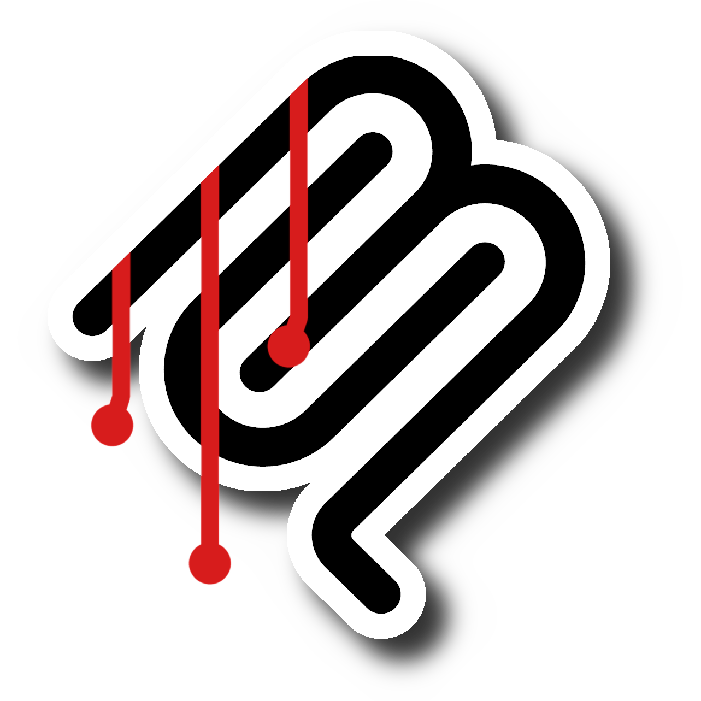

<p align="center">
  <a href="https://killertools.net/mcp"></a><br>
  <a href="https://killertools.net/mcp"></a>
</p>

One local MCP connection for KillerTools and the Killer app family: KillerPDF, KillerNotes, KillerScan, KillerShell, and Killendar.

KillerMCP is a native .NET 10 host. It detects supported Killer apps, exposes their available commands, and registers one MCP server with compatible agent clients. The separate [KillerTools repository](https://github.com/SteveTheKiller/KillerTools) provides the shared engine for the website utilities.

## Install

[Download the signed KillerMCP installer](https://github.com/SteveTheKiller/KillerMCP/releases/latest/download/KillerMCP-Setup.exe), run setup, then open a new agent chat. Setup checks for the .NET 10 runtime and registers KillerMCP with Codex, Claude Code, Claude Desktop, Cursor, GitHub Copilot, Gemini CLI, and Windsurf when those clients are found.

Fully quit and reopen an agent client after setup or upgrade, then start a new chat. In Claude Desktop, KillerMCP appears under Settings > Developer as a running local server and under Connectors as a desktop connector. Cowork can use that local connection without a separate plugin.

Once connected, ask naturally:

- `killer domain search example.com`
- `killer merge these PDFs`
- `killerscan my network`
- `killer update status`

The server supplies tool descriptions and instructions that help the client select the appropriate tool. Client behavior varies, so these phrases are guidance rather than guaranteed commands.

KillerMCP checks GitHub Releases hourly and shows a Black/Fuchsia update window when a newer version is available. Choose whether future updates should stay off, check and ask, download and ask, or install automatically. Every downloaded installer must match the published SHA256 and pass Windows signature verification before it can run.

## What it includes

- All 81 KillerTools website utilities from the native KillerTools engine.
- Automatic tool discovery for supported versions of KillerPDF, KillerScan, KillerNotes, KillerShell, and Killendar.
- Safe migration from the earlier Node based KillerMCP installation and client registrations.
- Install, reinstall, repair, and uninstall behavior through the KillerUI styled Windows setup.
- A framework dependent native package for each supported operating system and processor architecture.

KillerPDF provides PDF editing, conversion, inspection, OCR, printing, and accessibility tools when the installed version advertises them. KillerScan provides local network details, bounded scans, host probes, offline MAC vendor lookup, ping, route tracing, diagnostics, availability watching, and KillerSpeed tests. KillerShell provides read-only file browsing, text reading, file hashing, process and service listings, event log reading, registry inspection, and drive information. KillerNotes can search, read, create, edit, organize, color, import images, inspect links and history, and export notes. Killendar provides agenda lookup and creates single appointments while its window is open and unlocked.

Cross app workflows can export a KillerNotes note, KillerScan network report, Killendar agenda, or KillerShell directory listing to PDF. They can also save scan, agenda, and directory reports as notes, or render selected KillerPDF pages into image notes.

See [What KillerMCP can do](docs/CAPABILITIES.md) for the complete tool guide, examples, limits, and data handling details.

For tool permissions and invocation logging, see [Tool permissions and visibility](docs/CAPABILITIES.md#tool-permissions-and-visibility) and [Tool call history](docs/CAPABILITIES.md#tool-call-history).

## Build from source

Clone this repository with its pinned KillerTools engine source:

```powershell
git clone --recurse-submodules https://github.com/SteveTheKiller/KillerMCP.git
cd KillerMCP
```

Build and test the native host:

```powershell
dotnet build KillerMCP.slnx -c Release
powershell -NoProfile -File scripts\Test-All.ps1
```

Build a framework dependent package for the current platform:

```powershell
powershell -NoProfile -File scripts\Test-NativePackage.ps1
```

Build and test the Windows installer:

```powershell
powershell -NoProfile -File scripts\Test-WindowsInstaller.ps1
```

The native host requires the .NET 10 runtime. The Windows installer checks for it before installation and links to the official Microsoft download when it is missing.

For development builds or custom app locations, set `KILLERPDF_CLI`, `KILLERSCAN_CLI`, `KILLERNOTES_CLI`, `KILLENDAR_CLI`, or `KILLERSHELL_CLI` to an absolute executable path. An invalid override leaves that app unavailable instead of silently selecting another copy.

Run `powershell -NoProfile -File release.ps1` to build, sign, verify, and test the exact release installer without publishing it. Add `-Publish` only after the reviewed source is on `origin/main` and the changelog entry is dated for release.

Public installers are published through [KillerMCP releases](https://github.com/SteveTheKiller/KillerMCP/releases).

## License

KillerMCP is licensed under the [GNU General Public License Version 3](LICENSE).
